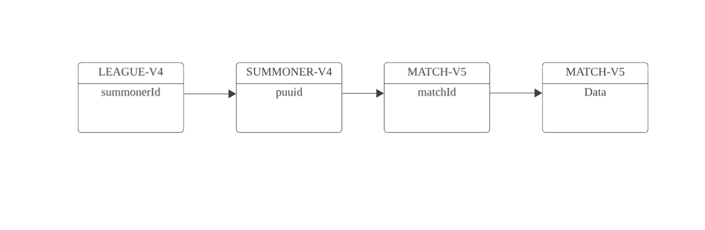

# 리그오브레전드 데이터 EDA 및 승리요인 분석

## 프로젝트 설명
라이엇 Open API에서 데이터를 가져와 챔피언별 상대승률, 현재 메타챔피언의 픽과 승리할 확률, 그리고 시야점수에 관련해 EDA를 수행하고, 승리와 관련된 요인을 분석해보며 승률을 예측하는 프로젝트입니다.

## 사용된 데이터
이 프로젝트에서 분석에 사용된 주요 데이터 필드는 다음과 같습니다:

| 필드 이름                  | 설명                                 |
|--------------------------|------------------------------------|
| `baronKills`             | 플레이어가 죽인 바론의 수                  |
| `basicPings`             | 플레이어가 보낸 기본 핑의 수                |
| `bountyLevel`            | 플레이어의 현상금 레벨                    |
| `champExperience`        | 플레이어 챔피언의 경험치                   |
| `champLevel`             | 플레이어 챔피언의 레벨                    |
| `championId`             | 플레이어가 사용한 챔피언의 식별자              |
| `championName`           | 플레이어가 사용한 챔피언의 이름               |
| `championTransform`      | 챔피언의 변신 상태나 관련 정보               |
| `consumablesPurchased`   | 구매한 소비성 아이템의 수                   |
| `damageDealtToBuildings` | 건물에 입힌 총 피해량                      |
| `damageDealtToObjectives`| 목표물에 입힌 총 피해량                    |
| `damageDealtToTurrets`   | 포탑에 입힌 총 피해량                      |
| `damageSelfMitigated`    | 플레이어가 감소시킨 피해량                   |
| `dangerPings`            | 위험 핑의 수                             |
| `detectorWardsPlaced`    | 설치된 감지 와드의 수                      |
| `dragonKills`            | 플레이어가 죽인 드래곤의 수                  |
| `enemyMissingPings`      | 적 미발견 핑의 수                         |
| `enemyVisionPings`       | 적 시야 핑의 수                           |
| `firstBloodAssist`       | 첫 번째 킬 도움을 기록했는지 여부                |
| `firstBloodKill`         | 첫 번째 킬을 기록했는지 여부                 |
| `firstTowerAssist`       | 첫 번째 포탑 파괴 도움을 기록했는지 여부          |
| `firstTowerKill`         | 첫 번째 포탑을 파괴했는지 여부                |
| `getBackPings`           | 물러가라는 핑의 수                         |
| `goldEarned`             | 플레이어가 벌어들인 골드                     |
| `holdPings`              | 대기 핑의 수                             |
| `individualPosition`     | 플레이어의 개별 포지션                      |
| `inhibitorKills`         | 파괴한 억제기의 수                        |
| `inhibitorTakedowns`     | 참여한 억제기 파괴의 수                     |
| `inhibitorsLost`         | 잃은 억제기의 수                          |
| `itemsPurchased`         | 구매한 아이템의 수                         |
| `killingSprees`          | 연속 킬 행진의 수                          |
| `largestCriticalStrike`  | 가장 큰 치명타 피해                        |
| `longestTimeSpentLiving` | 가장 오래 생존한 시간                       |
| `needVisionPings`        | 시야 필요 핑의 수                         |
| `neutralMinionsKilled`   | 죽인 중립 미니언의 수                       |
| `objectivesStolen`       | 도난당한 목표물의 수                        |
| `objectivesStolenAssists`| 도난당한 목표에 대한 도움의 수                 |
| `onMyWayPings`           | 가는 길 핑의 수                           |
| `participantId`          | 참가자 식별자                             |
| `pushPings`              | 밀어내기 핑의 수                          |
| `puuid`                   | 플레이어 고유 식별자                       |
| `sightWardsBoughtInGame`  | 구매한 시야 와드의 수                      |
| `teamPosition`            | 팀 포지션                                |
| `timeCCingOthers`         | 다른 플레이어를 제어한 시간                   |
| `timePlayed`              | 게임 플레이 시간                          |
| `totalAllyJungleMinionsKilled`| 팀 정글 미니언 처치 수                |
| `totalDamageDealt`        | 가한 총 피해량                            |
| `totalDamageDealtToChampions`| 챔피언에게 가한 총 피해량              |
| `totalDamageShieldedOnTeammates`| 팀원에게 적용한 피해 방어량          |
| `totalDamageTaken`        | 받은 총 피해량                            |
| `totalEnemyJungleMinionsKilled`| 적 정글 미니언 처치 수              |
| `totalHeal`                | 회복한 총량                              |
| `totalHealsOnTeammates`    | 팀원에게 적용한 총 회복량                  |
| `totalMinionsKilled`       | 죽인 총 미니언 수                        |
| `totalTimeCCDealt`         | 적에게 적용한 총 제어 시간                 |
| `totalTimeSpentDead`       | 총 사망 시간                             |
| `totalUnitsHealed`         | 치유한 총 유닛 수                        |
| `trueDamageDealt`          | 가한 순수 피해량                          |
| `trueDamageDealtToChampions`| 챔피언에게 가한 순수 피해량              |
| `trueDamageTaken`          | 받은 순수 피해량                          |
| `turretKills`              | 포탑 킬 수                               |
| `turretsLost`              | 잃은 포탑 수                             |
| `visionClearedPings`       | 시야 청소 요청 핑의 수                    |
| `visionScore`              | 시야 점수                                |
| `visionWardsBoughtInGame`  | 게임 중 구매한 시야 와드 수               |
| `wardsKilled`              | 제거한 와드 수                           |
| `wardsPlaced`              | 설치한 와드 수                           |
| `win`                      | 게임에서의 승리 여부                      |
## 분석 방법론
### 사용된 기술
- **언어 및 라이브러리**: Python, Pandas, Numpy, Matplotlib, Seaborn, Scikit-Learn
### 사용된 알고리즘
- **로지스틱 회귀(Logistic Regression)**, **랜덤 포레스트 분류기(Random Forest Classifier)**, **라이트 그라디언트 부스팅 모델(Light Gradient Boosting Model)**을 사용하여 Feature Importance 계산 및 요인 도출

## 설치 방법
1. 포함되어 있는 `.ipynb` 파일을 Google Colab에 업로드하거나 로컬 환경에 저장 후 Anaconda와 연결합니다.
2. 데이터가 크고, 머신러닝 분석이 필요하므로 컴퓨터 성능이 충분하지 않은 경우 Google Colab의 사용을 권장합니다.
3. ETL 코드를 실행하여 직접 데이터를 긁어 오거나, 업로드한 데이터 파일을 사용하여 분석을 진행합니다.

## 사용 방법
### 데이터 수집 과정
1. Riot OpenAPI에서 리그오브레전드 천상계 솔랭 데이터를 아래와 같은 방식으로 가져옵니다:

    

2. 가져온 match 데이터에서 participant(참가자) 데이터들을 `pd.concat`을 통해 합칩니다.
3. 분석에 필요 없는 컬럼을 제외하고, `teamPosition` 같은 컬럼은 encoding 처리하여 분류합니다.

### 데이터 분석 및 시각화
1. Matplotlib과 Seaborn을 사용하여 챔피언별 상대승률, 메타 챔피언의 승리 확률, 시야 점수 등에 대해 EDA 결과를 시각화합니다.
2. `Correlation Matrix`를 사용하여 변수 간의 연관성을 확인하고, 다중공선성을 방지합니다.
3. `StandardScaler`를 사용하여 데이터 스케일링을 진행합니다.
4. Logistic Regression, Random Forest, LGBM을 사용하여 피처 중요도를 계산합니다.
5. 중요한 요인들을 도출하고 시각화합니다.
6. `test_data.csv` (그랜드마스터 매치 데이터)를 사용하여, 랜덤 포레스트와 LGBM 모델로 승리를 예측하고 평가합니다.

## 추후 기여 방법
- 추가로 아이언~골드의 데이터를 수집하여 천상계가 아닌 대부분의 유저들의 게임 별 승리 요인 분석을 진행해보고, 천상계의 승리 요인과 비교해봅니다.
